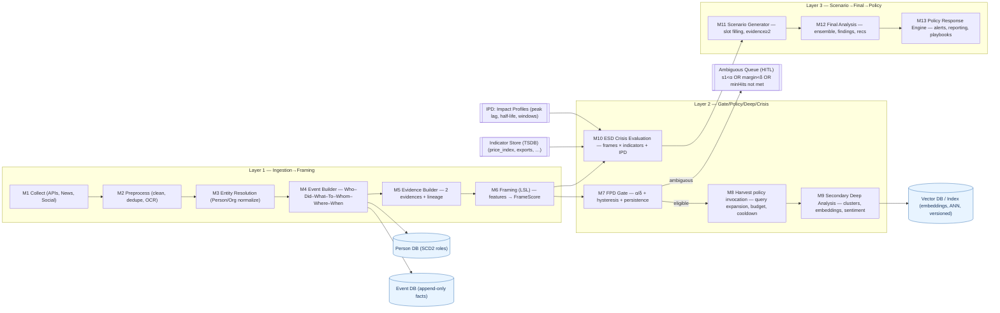

```mermaid
flowchart LR
  subgraph L1[Layer 1 — Ingestion→Framing]
    M1["M1 Collect (APIs, News, Social)"]
    M2["M2 Preprocess (clean, dedupe, OCR)"]
    M3["M3 Entity Resolution (Person/Org normalize)"]
    M4["M4 Event Builder — Who–Did–What–To–Whom–Where–When"]
    M5["M5 Evidence Builder — 2 evidences + lineage"]
    M6["M6 Framing (LSL) — features → FrameScore"]
    M1 --> M2 --> M3 --> M4 --> M5 --> M6
  end
  subgraph L2[Layer 2 — Gate/Policy/Deep/Crisis]
    M7["M7 FPD Gate — α/δ + hysteresis + persistence"]
    M8["M8 Harvest policy invocation — query expansion, budget, cooldown"]
    M9["M9 Secondary Deep Analysis — clusters, embeddings, sentiment"]
    M10["M10 ESD Crisis Evaluation — frames × indicators + IPD"]
  end
  subgraph L3[Layer 3 — Scenario→Final→Policy]
    M11["M11 Scenario Generator — slot filling, evidence≥2"]
    M12["M12 Final Analysis — ensemble, findings, recs"]
    M13["M13 Policy Response Engine — alerts, reporting, playbooks"]
    M11 --> M12 --> M13
  end
  PDB[("Person DB (SCD2 roles)")]
  EDB[("Event DB (append-only facts)")]
  VDB[("Vector DB / Index (embeddings, ANN, versioned)")]
  IND[["Indicator Store (TSDB) (price_index, exports, …)"]]
  IPD[["IPD: Impact Profiles (peak lag, half-life, windows)"]]
  AQ[["Ambiguous Queue (HITL) s1<α OR margin<δ OR minHits not met"]]
  M6 --> M7
  M6 --> M10
  M7 -->|eligible| M8 --> M9 --> VDB
  M7 -->|ambiguous| AQ
  M10 --> M11
  M4 --> PDB
  M4 --> EDB
  IND --> M10
  IPD --> M10
  classDef store fill:#E8F4FF,stroke:#2b6cb0,color:#1a365d;
  class PDB,EDB,VDB store;
```