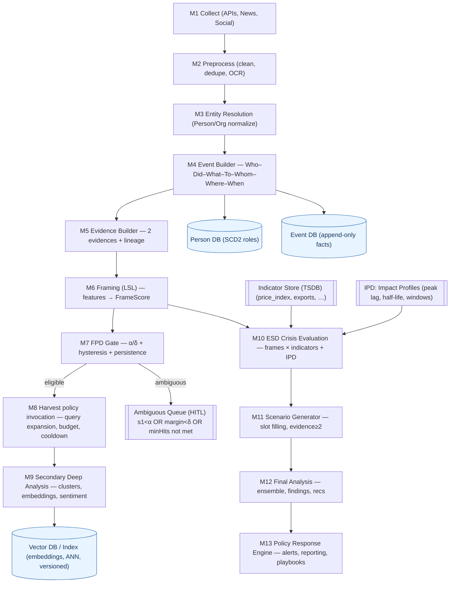

```mermaid
flowchart TB
  M1["M1 Collect (APIs, News, Social)"] --> M2["M2 Preprocess (clean, dedupe, OCR)"]
  M2 --> M3["M3 Entity Resolution (Person/Org normalize)"]
  M3 --> M4["M4 Event Builder — Who–Did–What–To–Whom–Where–When"]
  M4 --> M5["M5 Evidence Builder — 2 evidences + lineage"]
  M5 --> M6["M6 Framing (LSL) — features → FrameScore"]
  M6 --> M7["M7 FPD Gate — α/δ + hysteresis + persistence"]
  M7 -->|eligible| M8["M8 Harvest policy invocation — query expansion, budget, cooldown"]
  M8 --> M9["M9 Secondary Deep Analysis — clusters, embeddings, sentiment"]
  M9 --> VDB[("Vector DB / Index (embeddings, ANN, versioned)")]
  M6 --> M10["M10 ESD Crisis Evaluation — frames × indicators + IPD"]
  M10 --> M11["M11 Scenario Generator — slot filling, evidence≥2"]
  M11 --> M12["M12 Final Analysis — ensemble, findings, recs"]
  M12 --> M13["M13 Policy Response Engine — alerts, reporting, playbooks"]
  IND[["Indicator Store (TSDB) (price_index, exports, …)"]] --> M10
  IPD[["IPD: Impact Profiles (peak lag, half-life, windows)"]] --> M10
  M7 -->|ambiguous| AQ[["Ambiguous Queue (HITL) s1<α OR margin<δ OR minHits not met"]]
  M4 --> PDB[("Person DB (SCD2 roles)")]
  M4 --> EDB[("Event DB (append-only facts)")]
  classDef store fill:#E8F4FF,stroke:#2b6cb0,color:#1a365d;
  class PDB,EDB,VDB store;
```